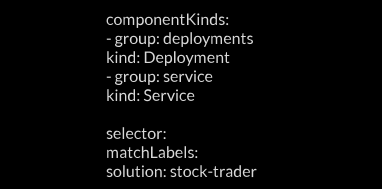

    
    <section class="logo_content">
        

            
            
        
                
kAppNav

                
Kubernetes Application Navigator

            

        

        
{{ site.description }}

        <a class="button" id="getting_started" href="https://github.com/kappnav/README" target="_blank" rel="noopener">Get Started</a>
    </section>
    <section class="graphic">
        
    </section>
    

        <h1 class="info_title">Cloud Native and Beyond</h1>
        

        Designed to provide <b>quick inspection, issue determination, and error resolution</b>, the Kubernetes Application Navigator (kAppNav) compliments the Kubernetes® console by enabling robust management of the deployed resources that comprise an application.
        

        

            
        

        

            
        

        

            
        

        

            
kAppNav uses the <a class="description_link" href="https://github.com/kubernetes-sigs/application/blob/master/config/crd/bases/app.k8s.io_applications.yaml" target="_blank" rel="noopener">Application Custom Resource Definition (CRD)</a> from the <a class="description_link" href="https://github.com/kubernetes-sigs/application" target="_blank" rel="noopener">Kubernetes Application SIG</a> as the basis for describing the applications.

        

        

            
        

        

            
Packaged with Kabanero, kAppNav is a centralized view of applications, deployed resources, and robust actions for error remediation. Learn more at <a class="description_link" href="https://kabanero.io/" target="_blank" rel="noopener">kabanero.io</a>.

        

        

            
        

        

            
        

    

    

        
    

    

        <h1 class="customizable_title">Customizable</h1>
        

            <h3>Resources</h3>
            
<a class="description_link" href="https://github.com/kappnav/samples/tree/master/legacyapp" target="_blank" rel="noopener">Custom resource definitions</a> ensure that legacy application status and end-points are visible in Kubernetes, alongside traditional cloud-native applications.

        

        

            <h3>Actions</h3>
            
Day 2 operations and long term application management are enabled through pre-configured and customizable component specific actions.

        

        

            <h3>Applications</h3>
            
Use labels, expressions and kinds to configure applications, automatically organizing them to make operational tasks easier.

        

    

        

        
    

    

        <h1 class="builton_title">Built on open source</h1>
        

            
        

        

            
        

        

            
        

        

            
        

    

    

